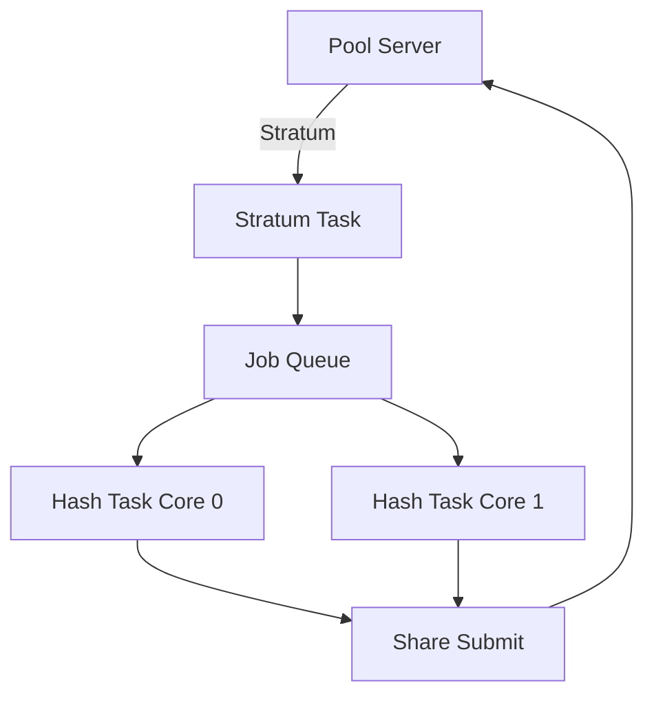

# PDQminer Documentation Standards

> **Version**: 1.0.0  
> **Last Updated**: 2025-01-XX  
> **Based On**: GitHub Spec Kit Standards

---

## 1. Documentation Hierarchy

```
docs/
├── agent-memory.md          # Agent context persistence
├── coding-standards.md      # Code style and conventions
├── documentation-standards.md   # This document
├── sdd.md                   # Software Design Document
├── tdd.md                   # Test-Driven Development Guide
├── api/                     # API reference documentation
│   └── README.md
├── architecture/            # Architecture diagrams and decisions
│   ├── README.md
│   └── adr/                 # Architecture Decision Records
├── specs/                   # Feature specifications
│   └── README.md
└── guides/                  # User and developer guides
    └── README.md
```

---

## 2. Markdown Formatting Standards

### 2.1 Document Header Template

Every documentation file must begin with:

```markdown
# Document Title

> **Version**: X.Y.Z  
> **Last Updated**: YYYY-MM-DD  
> **Status**: Draft | Review | Approved | Deprecated  
> **Owner**: [Name or Team]

---

## Overview

Brief description of the document's purpose.

---
```

### 2.2 Heading Hierarchy

| Level | Usage | Example |
|-------|-------|---------|
| H1 (`#`) | Document title only | `# PDQminer API Reference` |
| H2 (`##`) | Major sections | `## Installation` |
| H3 (`###`) | Subsections | `### Prerequisites` |
| H4 (`####`) | Minor subsections | `#### macOS Setup` |
| H5+ | Avoid if possible | — |

### 2.3 Code Block Formatting

Always specify the language for syntax highlighting:

````markdown
```c
int32_t PdqMinerInit(void)
{
    return 0;
}
```
````

**Supported languages in this project:**
- `c` - C source code
- `h` - Header files (use `c`)
- `bash` - Shell commands
- `json` - Configuration files
- `markdown` - Documentation examples

### 2.4 Tables

Use tables for structured data:

```markdown
| Column 1 | Column 2 | Column 3 |
|----------|----------|----------|
| Value 1  | Value 2  | Value 3  |
```

### 2.5 Admonitions

Use blockquotes with bold prefixes for callouts:

```markdown
> **Note**: Important information the reader should know.

> **Warning**: Potential issues or pitfalls.

> **Tip**: Helpful suggestions.

> **Important**: Critical information that must not be missed.
```

---

## 3. Specification Documents (Specs)

### 3.1 Feature Spec Template

```markdown
# Feature: [Feature Name]

> **Spec ID**: FEAT-XXX  
> **Version**: 1.0.0  
> **Status**: Proposed | Approved | Implemented | Deprecated  
> **Author**: [Name]  
> **Created**: YYYY-MM-DD

---

## Summary

One paragraph describing the feature.

## Motivation

Why is this feature needed? What problem does it solve?

## Detailed Design

### Requirements

1. **REQ-001**: Description of requirement
2. **REQ-002**: Description of requirement

### Technical Approach

Detailed technical description with diagrams if needed.

### API Changes

```c
/* New function signature */
int32_t NewFunctionName(params);
```

### Configuration

Any new configuration options.

## Testing Strategy

How will this feature be tested?

## Rollout Plan

How will this feature be deployed/released?

## Open Questions

- Question 1?
- Question 2?

## References

- Related documents
- External resources
```

### 3.2 Spec Naming Convention

```
specs/
├── FEAT-001-sha256-optimization.md
├── FEAT-002-stratum-protocol.md
├── FEAT-003-display-driver-abstraction.md
└── README.md
```

---

## 4. Architecture Decision Records (ADR)

### 4.1 ADR Template

```markdown
# ADR-XXX: [Decision Title]

> **Status**: Proposed | Accepted | Deprecated | Superseded  
> **Date**: YYYY-MM-DD  
> **Deciders**: [Names]  
> **Technical Story**: [Link to issue/spec]

---

## Context

What is the issue that we're seeing that is motivating this decision?

## Decision

What is the change that we're proposing and/or doing?

## Consequences

### Positive

- Benefit 1
- Benefit 2

### Negative

- Drawback 1
- Drawback 2

### Neutral

- Side effect 1

## Alternatives Considered

### Alternative 1: [Name]

Description and why it was rejected.

### Alternative 2: [Name]

Description and why it was rejected.
```

---

## 5. API Documentation

### 5.1 Function Documentation

```markdown
## `PdqSha256Double`

Computes the SHA256 double hash (SHA256d) of input data.

### Signature

```c
int32_t PdqSha256Double(
    const uint8_t *p_Input,
    uint32_t InputLength,
    uint8_t *p_Output
);
```

### Parameters

| Parameter | Type | Direction | Description |
|-----------|------|-----------|-------------|
| `p_Input` | `const uint8_t *` | In | Pointer to input data |
| `InputLength` | `uint32_t` | In | Length of input in bytes |
| `p_Output` | `uint8_t *` | Out | Pointer to 32-byte output buffer |

### Return Value

| Value | Description |
|-------|-------------|
| `0` | Success |
| `-1` | Invalid parameter (null pointer) |
| `-2` | Input length exceeds maximum |

### Example

```c
uint8_t Header[80] = { /* block header data */ };
uint8_t Hash[32];

int32_t Result = PdqSha256Double(Header, 80, Hash);
if (Result == 0) {
    /* Hash computed successfully */
}
```

### Notes

- Output buffer must be pre-allocated with at least 32 bytes
- This function is thread-safe
- Uses hardware acceleration on ESP32 when available

### See Also

- `PdqSha256Single()` - Single SHA256 hash
- `PdqSha256Midstate()` - Compute midstate for optimization
```

---

## 6. Code Comments to Documentation

### 6.1 Doxygen-Compatible Format

All code documentation must be extractable by Doxygen:

```c
/**
 * @defgroup SHA256 SHA256 Hashing Module
 * @brief    High-performance SHA256 implementation for Bitcoin mining
 * @{
 */

/**
 * @brief   Compute SHA256 double hash
 * 
 * @details This function computes SHA256(SHA256(input)) which is the
 *          standard hash function used in Bitcoin block header hashing.
 *          
 *          The implementation uses midstate optimization when possible
 *          to reduce computation for nonce iteration.
 *
 * @param[in]   p_Input      Input data buffer
 * @param[in]   InputLength  Length of input data
 * @param[out]  p_Output     32-byte output buffer
 *
 * @return  0 on success, negative error code on failure
 *
 * @retval  PdqErrorNone          Success
 * @retval  PdqErrorInvalidParam  Null pointer provided
 *
 * @note    This function is optimized for 80-byte Bitcoin block headers.
 *
 * @see     PdqSha256Midstate
 * @see     PdqSha256Single
 */
int32_t PdqSha256Double(const uint8_t *p_Input, 
                        uint32_t InputLength,
                        uint8_t *p_Output);

/** @} */  /* End of SHA256 group */
```

---

## 7. Diagrams

### 7.1 ASCII Diagrams (Inline)

For simple diagrams, use ASCII art:

```
┌─────────────────┐     ┌─────────────────┐
│  Stratum Task   │────▶│  Job Queue      │
└─────────────────┘     └────────┬────────┘
                                 │
                                 ▼
┌─────────────────┐     ┌─────────────────┐
│  Hash Task 0    │◀────│  Job Dispatch   │
└─────────────────┘     └────────┬────────┘
                                 │
┌─────────────────┐              │
│  Hash Task 1    │◀─────────────┘
└─────────────────┘
```

### 7.2 Mermaid Diagrams (When Supported)



---

## 8. Changelog Format

### 8.1 CHANGELOG.md Structure

```markdown
# Changelog

All notable changes to PDQminer will be documented in this file.

The format is based on [Keep a Changelog](https://keepachangelog.com/en/1.0.0/),
and this project adheres to [Semantic Versioning](https://semver.org/spec/v2.0.0.html).

## [Unreleased]

### Added
- New feature description

### Changed
- Change description

### Fixed
- Bug fix description

### Removed
- Removed feature description

## [1.0.0] - 2025-XX-XX

### Added
- Initial release
- SHA256d optimized hashing engine
- Stratum v1 protocol support
- ESP32-2432S028R board support (ILI9341 and ST7789)
```

---

## 9. Review Checklist

Before merging documentation:

- [ ] Correct header with version and date
- [ ] All code blocks have language specified
- [ ] Tables are properly formatted
- [ ] Links are valid and tested
- [ ] Spelling and grammar checked
- [ ] Technical accuracy verified
- [ ] Follows PascalCase in code examples
- [ ] No sensitive information exposed

---

## 10. Living Documents

The following documents must be updated with every significant change:

| Document | Update Trigger |
|----------|----------------|
| `agent-memory.md` | Every agent session |
| `CHANGELOG.md` | Every release |
| `sdd.md` | Architecture changes |
| `api/*.md` | API changes |

---

*This document is authoritative for all PDQminer documentation.*
